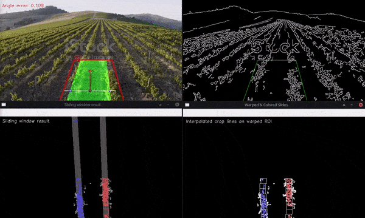

# Computer vision approach for crop-line detection and heading angle error estimation

## Quickstart

run ``` python3 scripts/main.py```

Press **q** to exit the program

Press **any other key** to show the result on the next frame

## Demo



> This is produced with viz_options =  DRAW_FINAL_RESULT | DRAW_SLIDING_WINDOW_RESULT | DRAW_ANGLE_ERROR_ON_IMAGE | DRAW_WINDOWS_ON_FRAME | DRAW_CENTER_ESTIMATION
